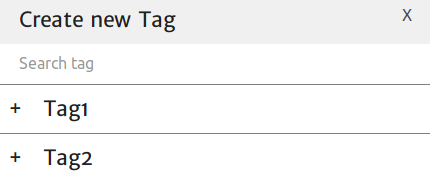
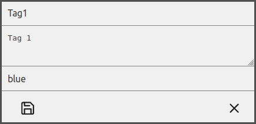
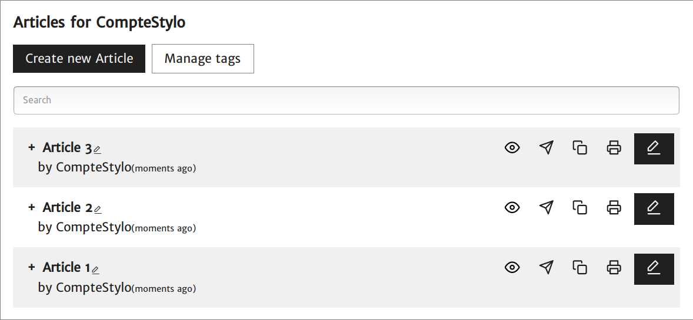
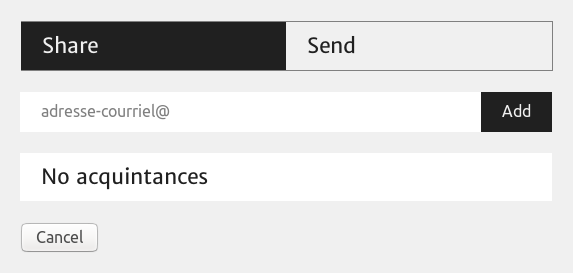
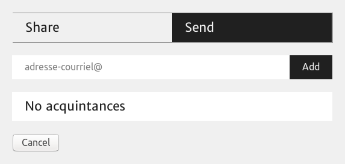

# Gérer mes articles

Vos articles sont disponibles dans la page _Articles_ clicable via la barre latérale de votre compte Stylo :

En haut de cette page, vous sont proposées plusieurs fonctionnalités :

- la création d'un nouvel article
- l'éditon et la gestion des tags
- la recherche d'un article

## Créer un nouvel article

Cliquez sur le boutton “Create a new article” (vous devrez renseigner le titre de l’article dans la case prévue à cet effet, puis cliquer à nouveau sur le bouton “Create”).

Pour créer un nouvel article, il suffit de cliquer sur le bouton :

.

Vous devez ensuite renseigner le nom du document dans le champs prévu à cet effet

et valider l'opération en cliquant une nouvelle fois sur le bouton

.

Lors de cette opération, il vous est également possible d'ajouter des tags à l'article en cliquant sur le bouton

**Attention** : vous ne pouvez ajouter que des tags déjà édités dans votre compte Stylo.

L’article apparait désormais dans votre liste d’articles.

## Éditer et gérer vos tags

Pour créer et éditer vos tags, cliquez sur "Manage tags". Un volet de gauche apparaît alors :

Il vous est possible en cliquant sur le nom du tag de sélectionner dans votre liste d'articles seulement les articles concernés par le tag en question.

Vous pouvez visualiser les détails du tag en cliquant sur le "+" situé à côté du nom du tag :

Vous avez alors accès au descriptif du tag en lecture, mais également à plusieurs fonctionnalités :

|bouton|fonction|
|:-:|:--|
|  | pour supprimer le tag. |
|  | pour ouvrir le tag en édition|

Le mode édition du tag se présente ainsi :

Cet espace vous permet de :

- modifier le nom du tag
- modifier le descriptif du tag
- choisir une couleur du tag en renseignant le champs avec les possibilités suivantes : "blue", "pink", "red", "green", "yellow", "black", "white", "brown", "cyan", "magenta" ...

N'oubliez pas d'enregistrer vos modifications une fois votre édition du tag terminée.

## Effectuer une recherche dans vos articles

Une barre latérale de recherche vous est proposée pour effectuer une recherche parmi vos articles.

## Pages articles de votre compte Stylo

Sur votre page Article, vos article sont listés les uns en dessous les autres selon les modifications les plus récentes :

Chaque article se présente comme un bloc dans votre liste. Cet espace dédié à un article seulement vous permet d'effectuer plusieurs opérations immédiates :

|bouton|fonction|
|:-:|:--|
|  | pour renommer l'article|
|  |  pour prévisualiser l'article |
|  | pour partager l'article et son historique de versions avec un autre usager de Stylo qui s'intitulera ainsi : "[Copy]Titre de l'article"|
|  | pour dupliquer uniquement la dernière version de l'article|
|  | pour dupliquer uniquement la dernière version de l'article|
|  | pour ouvrir l'article en édition|

Vous pouvez également développer le bloc de l'article en cliquant sur l'icone "+" située à gauche du titre de votre article. Vous avez alors accès à :

|bouton|fonction|
|:-:|:--|
|  | pour consulter l'historique des versions enregistrées |
|  | pour renseigner les tags de l'article en cliquant sur "edit" |
|  | pour supprimer l'article. |

## Renommer un article

Vous pouvez renommer votre article en cliquant sur le bouton "Rename" situé à côté du titre actuel de votre article et signifié par l'icone du crayon :

Après avoir modifié le titre de l'article selon votre convenance, n'oubliez-pas d'enregistrer :

## Prévisualiser un article

Il vous est possible de prévisualiser votre article en cliquant sur l'icone suivante :

La prévisulisation vous permettra la lecture du contenu de l'article édité et l'[annotation](http://stylo-doc.ecrituresnumeriques.ca/fr_FR/#!pages/preview.md).

## Partager un article

Vous pouvez également partager votre article avec d'autres utilisateurs Stylo en cliquant sur l'icone suivante :

Pour partager, vous devez renseigner l'adresse courriel de l'utilisateur Stylo : il s'agit de l'adresse courriel avec laquelle l'utilisateur a créé son compte Stylo. Une fois l'adresse renseignée, il vous faut l'ajouter en cliquant sur le bouton "Add".

La fonction [Share] permet à plusieurs utilisateurs Stylo de travailler sur le même article. Ces utilisateurs ont alors accès à tout l'historique. Les versions de l'article se synchronisent pour tous les utilisateurs au-fur-et à mesure des modifications effectuées sur le document.

Cette fonctionnalité vous permet également d'envoyer l'article avec le même système :

L'option [Send] n'est pas un partage d'article, seulement la dernière version de l'article sera visible par l'utilisateur, et les modifications ne seront pas visibles par les deux utilisateurs. Dans le processus [Send], deux versions de l'article sont créées et les utilisateurs travaillent chacuns sur une version qui n'est pas visible par l'autre.

## Dupliquer un article

Vous pouvez dupliquer votre article en cliquant sur l'icone suivante :

|

Un doublon de l'article sera alors généré et apparaîtra en haut de la liste de vos articles Stylo. Cet article sera intitulé automatiquement comme suit : "[Copy]Titre de l'article". Ce doublon est créé à partir de la version actuelle (celle en cours d'édition) de l'article et ne comporte alors pas d'historique de versions.

## Exporter un article

Pour exporter un article, il faut cliquer sur le bouton "export" :

Le menu d'export permets de choisir le format d'export, le style bibliographique et si l'on veut ou pas intégrer une table de matières.

Les formats supportés sont:

- HTML5
- PDF
- ODT
- tex
- DOCX
- EPUB
- TEI
- ICML
- XML Erudit
- ZIP (avec les fichiers source: markdown, yaml et bibtex)

Il est possible de choisir parmi plusieurs styles bibliographiques dont certains intègrent la référence dans le texte (par exemple Chicago, qui insère la référence dans le corps du texte entre parenthèses) et d'autres ajoutent une note avec la référence.

Le module d'export se charge de mettre en forme les références, d'ajouter ou enlever les espaces, d'insérer des "Ibid." en accord avec le style etc.

Les exports sont produits grâce à l'outil de conversion [pandoc](https://pandoc.org/) sur la base de tempates disponibles [ici](https://framagit.org/ecrinum/templates-stylo).

L'export permet aussi de télécharger les fichiers source de Stylo - et les médias insérés dans l'article s'il y en a.

### Personaliser son export

À partir des fichiers sources, il est possible de produire des exports personalisés - mise en page, graphisme, métadonnées - en utilisant l'outil de conversion [pandoc](https://pandoc.org/).

Pour plus d'informations sur l'emploi des templates, cf. ce [tutoriel](https://framagit.org/marviro/tutorielmdpandoc/blob/master/parcours/04_edition.md#les-templates-dans-pandoc)

## Développer les autres fonctionnalités de l'article

Pour développer d'autres fonctions de l'article, il faut cliquer sur l'icone "+" située à gauche du titre de votre article :

### Accèder aux versions de l'article

Vous avez alors accès aux versions majeures et mineures de l'articles : un clic sur le nom d'une version vous conduit à la page en mode "Édition" de la version en question.

**Attention** : la page de la version à laquelle vous avez accès, bien qu'elle soit dans le mode "Édition", ne vous permet pas d'effectuer des modifications sur le contenu de l'article. Il s'agit d'une page en mode lecture uniquement à partir de laquelle vous pouvez effectuer des [exports]() et des [comparaisons]().

### Tager un article

Vous pouvez également tagger votre articles : l'ajout d'un mot-clef vous permettra d'organiser vos articles dans la listes. Pour ajouter un tag à votre article, il vous faut cliquer sur l'option "edit" :

Les tags existants déjà renseignés dans votre pages vous sont proposés :

Il vous faut cliquer sur le tag souhaité et puis cliquer sur "finish" une fois les modifications voulues effectuées.

**Attention** : Cette fonctionnalité ne vous permet pas de créer des tags. Pour cela, il faut vous reporter à l'outil [Manage tags].

### Supprimer un article

Pour supprimer un article de la liste de vos articles, il vous faut cliquer sur l'icone suivante :

Un onglet rouge s'ouvrira automatiquement vous informant du processus de suppression :

Pour supprimer définitivement votre article, il vous faut double-cliquer sur "Delete".
