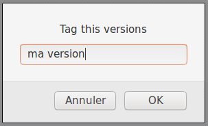
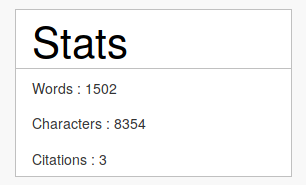

# Premiers pas

Un article dans Stylo est composé par trois éléments distincts :

  - un corps de texte
  - des métadonnées
  - une bibliographie

## Liste des articles

La page d'accueil liste vos articles et ceux qui ont été partagés avec vous.

Pour chaque article, plusieurs actions sont possibles :

|bouton|fonction|
|:-:|:--|
|  | pour ouvrir l'article en édition|
|  | pour partager l'article et son historique avec un autre usager de Stylo|
|  | pour envoyer uniquement la dernière version de l'article à un autre usager de Stylo|
|  | pour renommer l'article|
|  | pour supprimer l'article et toutes ses versions|

Note: Le nom de l'article ne correspond pas au titre final de l'article.

Attention: Supprimer un article est irréversible.

 Le bouton **[+]** présente la dernière version enregistrée, sur laquelle plusieurs actions sont accessibles :

|bouton|fonction|
|:-:|:--|
|  | pour ouvrir cette version de l'article en lecture. |
|  | pour créer une nouvelle version de l'article en édition |
|  | pour créer un nouvel article clone à partir de cette version |

## [share] [fork] [send] ?

La fonction **[share]** permet d'inviter des co-auteurs à travailler sur le même article. Ils ont alors accès à tout l'historique. Les versions de l'article se synchronisent pour tous les utilisateurs au-fur-et à mesure des modifications.

La fonction **[fork]** est utile pour créer, à partir de la dernière version, un nouvel article, vierge de l'historique des versions. Dans ce cas, le nouvel article est ajouté à la liste de vos articles.

La fonction **[send]** fait la même opération, mais le nouvel article est directement envoyé à un autre usager. Dans ce cas, le nouvel article n'est pas ajouté à la liste de vos articles. On l'utilise par exemple pour soumettre un article à un éditeur pour révision. Après révision, l'éditeur pourra soit "partager" **[share]** l'article révisé, donnant accès à l'auteur aux annotations des évaluateurs, soit "envoyer" **[send]** l'article pour ne lui donner accès qu'à la version modifiée sans le suivi des annotations.

## Nouvel article

Pour créer un nouvel article, il suffit de cliquer sur le bouton, 

puis de rentrer un nom d'article dans le champs ouvert 

## Édition

L'environnement d'édition est composé de 5 modules :

- au centre : l'espace d'écriture, consacré au corps de texte de l'article
- à droite : le bouton [Metadata] ouvre l'éditeur de métadonnées
- à gauche :
  - les Versions pour naviguer et agir sur les différentes versions de l'article
  - le Sommaire de l'article liste les titres de niveau 2 et 3
  - la Bibliographie liste les références bibliographiques
  - les Statistiques offrent quelques données quantitatives sur l'article

## - Versions

Il n'y a pas de bouton "Save" ou "Sauvegarder" dans Stylo ! En effet votre travail est automatiquement sauvegardé

Le module Versions contient :

1. une liste d'actions pour la version active
2. une liste des versions

La liste des versions permet de passer de la version éditable (Live) à une version antérieure. La version active est grisée dans la liste des version. Une version contient toujours les trois éléments de l'article : métadonnées, bibliographie, corps de texte. Ainsi en chargeant une ancienne version, ce sont ces trois éléments qui sont mis à jour. 

Un simple clic sur une version permet de charger (activer) la version d'un article.

Pour revenir à la version éditable (_Live_), il suffit de cliquer sur [Live] tout en haut de la liste des versions. 

Pour la version éditable (_Live_), plusieurs fonctions sont disponibles :

|bouton|fonction|
|:-:|:--|
| | pour enregistrer une version majeure  |
| | pour enregistrer une sous-version |
| | pour exporter et de télécharger le document dans différents format : html5, xml erudit, etc.  |
| | pour ouvrir la version html annotable  |

Pour une version antérieure (non éditable), s'ajoute la fonction [Tag] :

|bouton|fonction|
|:-:|:--|
||pour ajouter une appelation de version|

## - Export
Le module d'export offre plusieurs formats et permet également de choisir entre deux styles de citations : 

* inline citations : la référence de type _(Goody, 1976)_ est ajoutée dans le corps du texte,
* footnotes citations : la référence est intégrée avec un appel de note.

|bouton|fonction|
|:-:|:--|
|![[preview]](uploads/images/preview.png) | pour ouvrir l'aperçu html de l'article   |
|![[HTML]](uploads/images/html.png) | pour télécharger une version html prête à mettre en ligne |
|![[XML (erudit])](uploads/images/xml.png) | pour prévisualiser une version xml au schéma Erudit |
|![[ZIP]](uploads/images/zip.png) | pour télécharger les trois composants de l'article : métadonnées (.yaml), bibliographie (.bib), corps de texte (.md)  |

## - Sommaire

Le sommaire affiche une liste des titres de niveau 1, 2 et 3. Ces titres sont clicables pour accéder rapidement à une partie du texte. 

## - Bibliographie

La bibliographie liste les références bibliographiques que vous avez ajoutées. Les références bibliographiques peuvent être ajoutées une par une, ou groupées.

Les références doivent être ajoutées au format bibtex. Vous pouvez directement [structurer vos références en bibtex](http://www.andy-roberts.net/writing/latex/bibliographies), ou exporter vos références en bibtex grâce à votre outils de gestion de bibliographie :

- voir tutoriels : <a class="btn btn-info" href="http://sens-public.org/IMG/pdf/Utiliser_Zotero.pdf" role="button">Zotero</a> <a class="btn btn-info" href="https://libguides.usask.ca/c.php?g=218034&p=1446316" role="button">Mendeley</a>

Pour ajouter une référence à l'article, il suffit de cliquer sur la référence, puis de coller la référence dans le texte à l'endroit souhaité. Ainsi, un clic revient à "copier" la clé de la référence dans le presse-papier. Il ne reste plus qu'à la coller dans le corps de texte. 

NOTE: Il sera bientôt possible de synchroniser un dossier Zotero avec l'outil de bibliographie. Les références se mettront à jour alors automatiquement à jour avec le dossier Zotero.

## - Métadonnées

Le bouton [Metadata] permet d'ouvrir le volet de métadonnées. Deux modes d'édition sont disponibles : 

1. **Mode auteur (simple)** - permet d'éditer les métadonnées fondamentales: Titre, sous-titre, résumés, auteurs et mots-clés.
2. **Mode éditeur (avancé)** - permet d'éditer l'ensemble des métadonnées relatives à une revue savante : identifiant d'un article, informations de dossier, information d'évaluation, catégories de la revue, mots-clés de la revue, etc.

## - Statistiques

Le menu "Statistiqes" donne des informations sur: 

- Le nombre de mots
- Le nombre de caractères
- Le nombre de citations

## Annotation

Il y a deux possibilités d'annotation:

1. Annoter une version
2. Annoter l'article

Pour annoter une version, cliquez sur le numéro de la version que vous voulez annoter et ensuite cliquez sur Anotate. Une prévisualisation de l'article en html s'ouvrira avec l'outil d'annotation hyothes.is sur la droite.
Si vous annotez une version, vos annotation ne seront pas visibles sur les autres versions.

Pour annoter l'article, cliquez sur Live et ensuite sur Anotate. Les annotations concerneront l'article. On pourra toujours les voir en regardant le "Anotate" du "Live". Cependant, puisque le live est sujet à des changements, les annotations pourront ne plus être ancrées aux bonnes parties du textes (qui pourraient avoir été supprimées ou déplacées).
